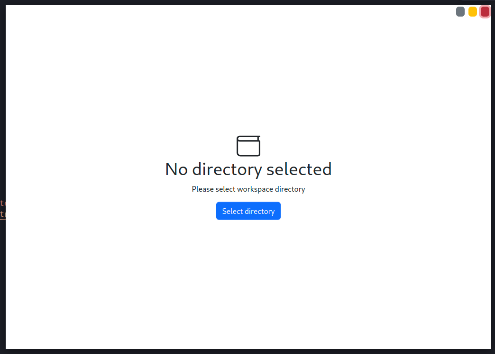
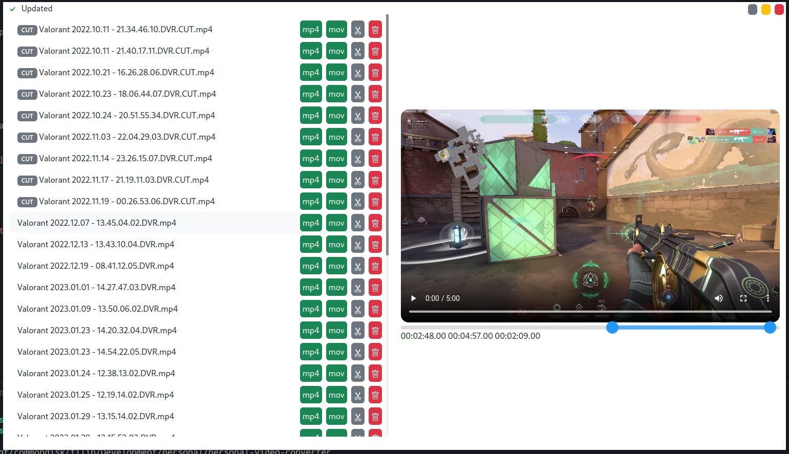
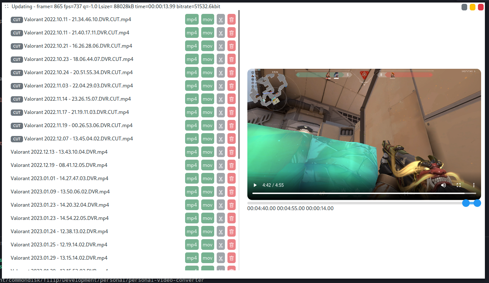

I started this project with [electron-react-boilerplate](https://github.com/electron-react-boilerplate/electron-react-boilerplate)

The goal was to provide video converter gui created specifically for me. So probably no user except me find it usefull but its gonna be cool tool for me and cool programming exercise. Software is usign react and electron and is calling `ffmpeg` commands underneeth. This means you need to have ffmpeg installed on your system if you want this program to work. First you need to select directry you want to operate on.



You gonna have a list with all videos inside this direcotry (other files and directories will be skiped). This dashboard will provide you with possibility to cut video, delete it or convert to either mp4 or mov.



If you perform some kind of action other buttons will be disabled until this action finishes and standard output will be displayed on top in the left corner.



Code requires some additional refactor but for now sofwtare is ready to be used by me and I might develop it more in the future.

## Starting Development

Start the app in the `dev` environment:

```bash
npm start
```

## Building executable (linux only for now)

To package apps for the local platform:

```bash
npm run build:exe:linux
```

## License

I left same licence as it was in [electron-react-boilerplate](https://github.com/electron-react-boilerplate/electron-react-boilerplate)
MIT © [Electron React Boilerplate](https://github.com/electron-react-boilerplate)
